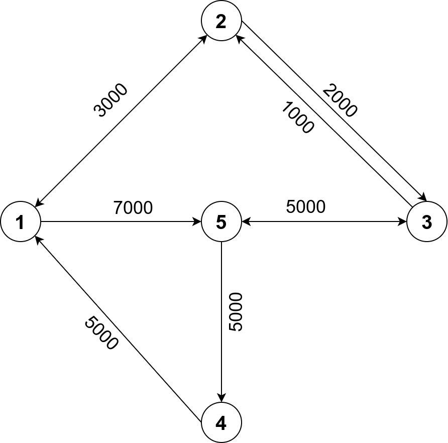

# Dijkstra Algorithm Shortest Path
This project repository demonstates the implementation of Djikstra Algorithm to find shortest path between two nodes using Go language. The solution of defined problem statement within this project is based on my perspective. You may have different approach to solve this problem.

# Contents
1. [Problem Statement](#problem-statement)
   * [Function Description](#function-description)
   * [Input Format](#input-format)
   * [Constraints](#constraints)
   * [Output Format](#output-format)
   * [Graph](#graph)
2. [Solution](#solution)
3. [Run](#run)

# Problem Statement
A driver is assigned to pick and deliver a food orders. But the driver have a difficulty to find the best way / route to deliver all of this orders. Your task is to find routes with the lowest expenses for the driver !

The first parameters is a 2D Array of Integer, orders assigned to the driver. Each orders will have this format : `[pick,destination]`.
pick, means driver must go to this location first to pick the delivery.
After driver arrives on pick location, then he will go to the destination.
The order must be done sequentially.
The second parameters is a 2D Array of Integer consisting of routes. Each items will represents bank transfer information in this format : `[from,to,cost]`.
from and to indicates the location driver can access to.
Cost is the amount expenses needed to use this route.

## Function Description
Complete the solution function in the code editor. Solution has the following parameter(s):

`orders` : Delivery orders assigned, can be more than 1.<br/>
`routes` : Routes that the driver can take and their costs.
this function will then returns :<br/>
`optimalRoute` : an array consisting of routes to finish this delivery. **Driver will always starts form position 1 !**

## Input Format
The first line contains ***t***, the number of orders.
Each of the order is as follow:
* The line containes two space-separated integers ***x*** and ***y***, represens the pick up point and destination point respectively.


Sample Input
```bash
2
2 5
5 1
9
1 2 3000
1 5 7000
2 1 3000
2 3 2000
3 5 5000
4 1 5000
5 4 5000
5 3 5000
3 2 1000
```
## Constraints


## Output Format
The output will be an Array of Integer `optimalRoute`, each number represents locations (defined in routes) to finish this delivery.

Sample Output
```bash
[1 2 3 5 3 2 1]
```

## Graph

Please be advised that this is a directed graph which represents route that the driver is allowed to travel indicated by the arrow pointing toward the node. For instance, node `1` has a bidirectional connection to node `2` with the same weight, the driver can go through frome node `1` to node `2` and vice versa. 


# Solution

# Run
1. Clone this repository and change directory to the root of cloned project folder.
```bash
git clone https://github.com/mushoffa/dijkstra-shortest-path-go.git
```
2. 
```bash
/dijkstra-shortest-path-go$ make run
```
3. Compare output of the running program against defined solution on `out` file to check whether it computes correctly. The `diff` command will return new line on terminal in case of success where the output of program matches defined text solution on `out` file.
```bash
/dijkstra-shortest-path-go$ diff <(go run main.go < in) out
/dijkstra-shortest-path-go$
```